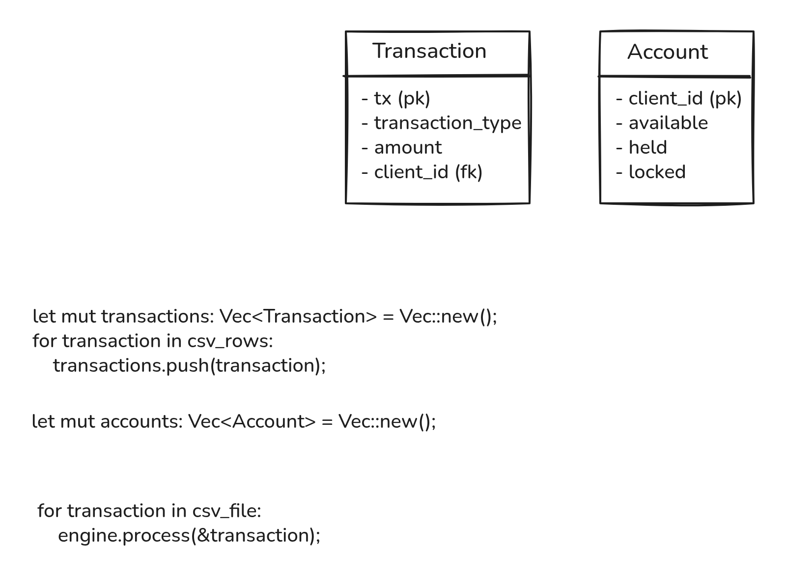
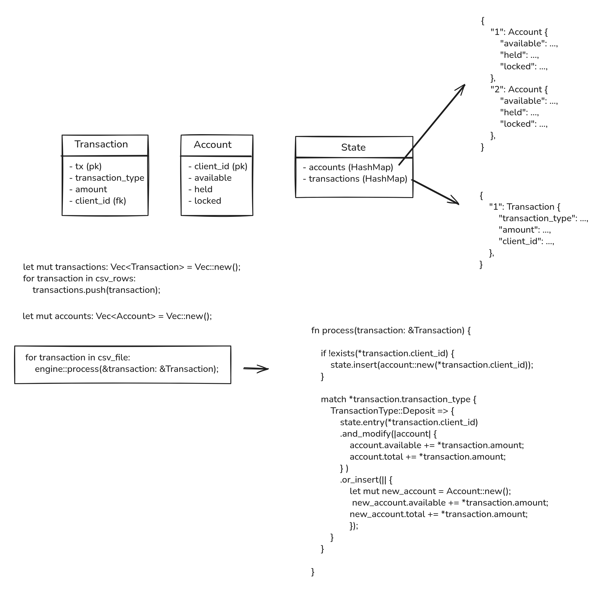

# Thought Process

I chose a coding style that prioritizes readability and clean code over efficiency and performance, following the assessment's guidance. Code that other developers can understand without my explanation can be optimized later. Efficient code that is difficult to understand is harder to maintain. This principle shaped both the architecture and the scope of the implementation.

## Sketching the flow

I wanted responsibilities clearly separated into their respective domains. My Excalidraw sketches started with `Account` and `Transaction`, then introduced a `State` with two `HashMap`s. Accounts needed lookup by client ID, and disputes needed lookup of earlier transactions by `tx`. Maps expressed those access patterns directly. The drawings also explored account creation and the deposit flow before those details settled into code.

*Initial sketch: the entities and the outline of CSV processing.*

*Later sketch: State connects the registries; the surrounding pseudocode explores lookup and insertion. These are working drafts, not the final implementation.*

The first implementation (`fa86f0c`) used `Copy` and `Clone` extensively. At that stage, I wanted to sketch my ideas without spending much time on ownership management. That let me express the complete processing flow first. Once the responsibilities were clearer, I replaced broad copying and cloning with mutation of stored accounts and short borrow scopes (`505b05d`). Input events move into processing, while IDs and decimal values can still be copied where appropriate.

## Giving each responsibility a home

I briefly put both registries directly inside `Engine`. Separating them again in `53b08b8` gave the code clearer boundaries: `Engine` coordinates operations and validates their context, `State` owns indexed data, and `Account` performs balance changes. Reading transaction information before mutably borrowing the account also keeps each borrow limited to the work that needs it.

The same commit separated `TransactionAttempt` from `SuccessfulTransaction`. A CSV event can fail or omit an amount for dispute operations; a stored successful transaction has a different purpose. It retains the client, amount, and dispute status needed by future events. Deposits and withdrawals enter that registry only after succeeding. I considered a ledger, but a registry better describes this lookup structure: it does not retain every attempted event as an accounting journal.

Serialization eventually moved into `output.rs` (`3becd4b`). Accepting a `Write` target separates CSV output from storage and allows output errors to propagate. Together, the boundaries are straightforward: the reader supplies events, the engine coordinates account and transaction state, and the output module serializes the final accounts.

I used `Decimal` for monetary values. I also considered computing `total` through a getter, but kept the explicit field and its existing serialization. That choice requires account operations to maintain `total = available + held`; tests check the resulting balances. A computed total remains a possible simplification.

## Making business decisions executable

I developed deposit and withdrawal first (`77d8194`, `12d4075`), then applied the same pattern to dispute, resolve, and chargeback: define the expected behavior, write tests, and implement the operation. For example, the dispute sequence is visible in `d142538`, `9147d62`, and `509efef`.

Tests at different boundaries answer different questions. Account tests check balance changes and rejections. Engine tests check transaction lookup, ownership, and dispute transitions. Integration tests run the binary with CSV input and inspect its output (`84a94a1`). Later regressions added client-ownership checks: first for dispute (`a32c8b5`), then for resolve and chargeback (`3904710`). A valid `tx` alone is insufficient; it must belong to the requesting client and be in the correct dispute state.

For locked accounts, I chose to reject new deposits, withdrawals, and disputes while allowing already-open disputes to finish through resolve or chargeback. This preserves the ability to settle pending disputes. Commit `8b540d2` makes the interpretation explicit in a sequence test. Another documented assumption is that successful deposits and withdrawals can both be disputed using the specification's general balance formula.

## Keeping the processing path simple

The initial reader collected all events into a `Vec`. Once the business flow was established, streaming each deserialized event directly into `Engine` removed that unnecessary input buffer (`e0efabc`). I considered returning an iterator; passing `&mut Engine` kept the interface simple for this CLI, with the tradeoff that the reader knows its consumer. State still grows with accounts and successful transactions because later disputes may reference them.

I also separated business rejection from technical failure. Invalid business events are ignored without a message for every row (`e787b51`). File, CSV, and output errors propagate to `main`, produce diagnostics on `stderr`, and return a failure exit code. Integration tests cover missing arguments, nonexistent files, and invalid input. Output account order remains unspecified, as the assessment permits; tests compare sorted records.

The resulting suite contains 32 unit tests and 6 integration tests. The final verification combines `cargo test`, `cargo fmt --check`, and `cargo clippy --all-targets --all-features -- -D warnings`. These checks complement the larger CSV inputs used during review.

## AI assistance and review

I designed the architecture, created the sketches, researched Rust documentation and web discussions, and estimate that I wrote approximately 80% of the code manually. Neither vibe coding nor spec-driven development was used. Codex helped implement the remaining approximately 20% after discussion and my decisions, particularly repetitive tests guided by TODO instructions. The intent, test, and implementation commits preserve examples of that workflow.

Google AI overviews helped with brief questions, alongside Rust documentation and discussions on Stack Overflow and Reddit. I also used Codex to generate extensive CSV inputs, review the implementation against my private `notes.md`, and propose fixes in two review rounds. I reviewed the changes and chose which interpretations to adopt. Codex drafted this document and the README for my review; the [README disclosure](../README.md#ai-assistance-disclosure) describes the scope, and I will add the supporting material to [ai-generated-material/](ai-generated-material/).
